<p align="center">
  
</p>

<h1 align="center">8004 Mint Protocol</h1>

<p align="center">
  <strong>AI-Native Permissionless Token Infrastructure on Ethereum</strong>
</p>

<p align="center">
  <a href="https://8004mint.com">Website</a> •
  <a href="#architecture">Architecture</a> •
  <a href="#documentation">Docs</a> •
  <a href="https://t.me/MoltStoryBot">MoltBot</a> •
  <a href="lp-locker/">LP Locker</a> •
  <a href="clanker-agent/">Clanker</a> •
  <a href="https://twitter.com/8004Mint">Twitter</a>
</p>

<p align="center">
  <a href="https://eips.ethereum.org/EIPS/eip-8004"></a>
  
  
  
  
  
  
  
  
</p>

<p align="center">
  
  
  
</p>

---

## Overview

**8004 Mint** is a revolutionary DeFi protocol combining **AI-powered evaluation**, **permissionless token minting**, **intelligent staking**, and **autonomous LP management**.

### Core Features

| Module | Description | Technology |
|--------|-------------|------------|
| **AI-Gated Minting** | ML models evaluate user submissions to qualify for token minting | GPT-4o, EIP-712 |
| **Dynamic Staking** | Multi-tier staking with up to 8x multipliers and VIP bonuses | Solidity, Time-locks |
| **MoltBot Trading** | Autonomous AI trading agent via Telegram | Telegraf, KyberSwap |
| **Neural LP Locker** | AI-driven dynamic liquidity locking with risk management | Policy Networks, DexScreener |

```
┌─────────────────────────────────────────────────────────────────────────────────┐
│                           8004 MINT PROTOCOL ARCHITECTURE                        │
├─────────────────────────────────────────────────────────────────────────────────┤
│                                                                                  │
│  ┌────────────────────────────────────────────────────────────────────────────┐ │
│  │                         USER INTERACTION LAYER                             │ │
│  │   ┌──────────┐    ┌──────────┐    ┌──────────┐    ┌──────────┐           │ │
│  │   │  Web UI  │    │ Telegram │    │  Wallet  │    │   API    │           │ │
│  │   │ (Vite)   │    │ (MoltBot)│    │(MetaMask)│    │ (REST)   │           │ │
│  │   └──────────┘    └──────────┘    └──────────┘    └──────────┘           │ │
│  └────────────────────────────────────────────────────────────────────────────┘ │
│                                       │                                          │
│  ┌────────────────────────────────────┼────────────────────────────────────────┐│
│  │                         AI DECISION LAYER                                   ││
│  │   ┌──────────────────┐    ┌──────────────────┐    ┌──────────────────┐    ││
│  │   │   Essay Scorer   │    │  Trading Agent   │    │   LP Policy Net  │    ││
│  │   │    (GPT-4o)      │    │    (GPT-4o)      │    │    (GPT-4o)      │    ││
│  │   └──────────────────┘    └──────────────────┘    └──────────────────┘    ││
│  │                            ┌──────────────────┐                             ││
│  │                            │  Clanker Agent   │                             ││
│  │                            │    (GPT-4o)      │                             ││
│  │                            └──────────────────┘                             ││
│  └────────────────────────────────────────────────────────────────────────────┘│
│                                       │                                          │
│  ┌────────────────────────────────────┼────────────────────────────────────────┐│
│  │                       SMART CONTRACT LAYER                                  ││
│  │   ┌──────────────┐  ┌──────────────┐  ┌──────────────┐  ┌──────────────┐  ││
│  │   │EssayGatedToken│  │StoryStakingV2│  │  Remittance  │  │  LP Locker   │  ││
│  │   │  (ERC-20)    │  │  (Staking)   │  │   (P2P OTC)  │  │  (EIP-8004)  │  ││
│  │   └──────────────┘  └──────────────┘  └──────────────┘  └──────────────┘  ││
│  └────────────────────────────────────────────────────────────────────────────┘│
│                                       │                                          │
│  ┌────────────────────────────────────┼────────────────────────────────────────┐│
│  │                       EXTERNAL INTEGRATIONS                                 ││
│  │   ┌──────────┐  ┌──────────┐  ┌──────────┐  ┌──────────┐  ┌──────────┐   ││
│  │   │  OpenAI  │  │KyberSwap │  │DexScreener│  │ Uniswap │  │ Etherscan│   ││
│  │   │  GPT-4o  │  │Aggregator│  │   API    │  │   V4    │  │   API    │   ││
│  │   └──────────┘  └──────────┘  └──────────┘  └──────────┘  └──────────┘   ││
│  └────────────────────────────────────────────────────────────────────────────┘│
│                                                                                  │
└─────────────────────────────────────────────────────────────────────────────────┘
```

---

## Repository Structure

```
8004mint/
├── contracts/                    # Solidity Smart Contracts
│   ├── EssayGatedToken.sol      # AI-gated ERC-20 with EIP-712 signatures
│   ├── StoryStakingV2.sol       # Advanced staking with dynamic multipliers
│   ├── LPLocker.sol             # Neural LP locking with AI actions
│   ├── ClankerFactory.sol       # AI token deployment factory
│   ├── Remittance.sol           # P2P OTC trading protocol
│   └── RemitToken.sol           # Utility token
│
├── frontend/                     # Web Application (Vite + TypeScript)
│   ├── src/
│   │   ├── main.ts              # SPA entry point (~3000 LOC)
│   │   └── index.css            # Tailwind CSS + Material Design 3
│   └── public/                  # Static assets
│
├── backend/                      # API Server (Express + TypeScript)
│   ├── src/
│   │   ├── server.ts            # REST API endpoints
│   │   ├── sign.ts              # EIP-712 signature generation
│   │   └── scoring/             # AI scoring engine
│   └── ...
│
├── trading-bot/                  # MoltBot AI Trading Agent
│   ├── src/
│   │   ├── index.ts             # Telegram bot (Telegraf)
│   │   ├── ai-agent.ts          # GPT-4o decision engine
│   │   ├── trading-engine.ts    # KyberSwap integration
│   │   ├── market-data.ts       # DexScreener data feeds
│   │   └── user-manager.ts      # Per-user wallet management
│   └── README.md
│
├── lp-locker/                    # Neural LP Locker Agent
│   ├── src/
│   │   ├── index.ts             # Main orchestrator
│   │   ├── state-observer.ts    # Multimodal state aggregation
│   │   ├── ai-policy-network.ts # GPT-4o policy network
│   │   └── execution-engine.ts  # On-chain execution
│   ├── architecture.svg         # System architecture diagram
│   └── README.md
│
├── clanker-agent/                # Clanker AI Token Factory
│   ├── src/
│   │   └── index.ts             # Token deployment agent
│   └── README.md
│
├── docs/                         # Documentation
│   ├── architecture.md          # System design
│   ├── tokenomics.md            # Token economics
│   ├── api.md                   # API reference
│   ├── contracts.md             # Smart contract docs
│   ├── moltbot.md               # Trading bot guide
│   └── clanker.md               # Clanker agent guide
│
├── scripts/                      # Deployment & utility scripts
│   ├── deploy.ts
│   ├── deploy-staking-v2.ts
│   └── ...
│
├── test/                         # Test suites
│   └── StoryStaking.test.ts
│
├── .github/                      # CI/CD & GitHub templates
│   ├── workflows/
│   │   ├── ci.yml               # Continuous integration
│   │   └── deploy.yml           # Auto-deployment
│   ├── ISSUE_TEMPLATE/
│   └── PULL_REQUEST_TEMPLATE.md
│
├── LICENSE                       # MIT License
├── CONTRIBUTING.md               # Contribution guidelines
├── SECURITY.md                   # Security policy
└── README.md                     # This file
```

---

## Deployed Contracts

All contracts are verified on **Ethereum Mainnet**:

| Contract | Address | Description |
|----------|---------|-------------|
| **STORY Token** | [`0xdC94E8Ab22d66bcC9b0BDB5E48711Fb12CBea74e`](https://etherscan.io/address/0xdC94E8Ab22d66bcC9b0BDB5E48711Fb12CBea74e) | AI-gated ERC-20 |
| **StoryStakingV2** | [`0xDF7C270C5f7Db77Abb334CEEb13D8491D9A00190`](https://etherscan.io/address/0xDF7C270C5f7Db77Abb334CEEb13D8491D9A00190) | Dynamic staking |
| **Remittance** | [`0xA0988eb9EE9310e841316dA7188e22C6Ae5eE9e2`](https://etherscan.io/address/0xA0988eb9EE9310e841316dA7188e22C6Ae5eE9e2) | P2P OTC |
| **RemitToken** | [`0xdf055fdCd8abdb4917f9A18B5dd91fE560300504`](https://etherscan.io/address/0xdf055fdCd8abdb4917f9A18B5dd91fE560300504) | Utility token |

**Base Network:**

| Contract | Address | Description |
|----------|---------|-------------|
| **ClankerFactory** | `TBD` | AI token deployment (pending deployment) |

---

## Core Modules

### 1. AI-Gated Token Minting

Users submit content (essays, stories) which are evaluated by GPT-4o. Scores >= 60 qualify for 100 STORY tokens.

```
User Content → GPT-4o Scoring → EIP-712 Signature → On-chain Claim
```

**Security Features:**
- EIP-712 typed data signatures
- Per-address nonces (replay protection)
- Single claim per wallet
- Minimum score threshold

### 2. Dynamic Staking System

Advanced staking with time-based multipliers and VIP tiers:

| Lock Period | Multiplier | | VIP Tier | Requirement | Bonus |
|-------------|------------|-|----------|-------------|-------|
| Flexible | 1.0x | | Bronze | 1,000 STORY | +10% |
| 30 Days | 1.5x | | Silver | 5,000 STORY | +20% |
| 90 Days | 2.5x | | Gold | 10,000 STORY | +35% |
| 180 Days | 4.0x | | Platinum | 25,000 STORY | +50% |
| 365 Days | 8.0x | | Diamond | 50,000 STORY | +75% |

### 3. MoltBot - AI Trading Agent

Autonomous trading bot accessible via Telegram:

<p align="center">
  <a href="https://t.me/MoltStoryBot">
    
  </a>
</p>

**Features:**
- GPT-4o real-time market analysis
- 1-minute decision cycles
- KyberSwap optimal routing
- Per-user isolated wallets
- Risk level configuration

**Commands:**
```
/create_wallet  - Generate trading wallet
/balance        - Check portfolio (STORY, USDC, ETH)
/price          - Current market data
/config [level] - Set risk (conservative/moderate/aggressive)
/start_trading  - Enable AI trading
/stop_trading   - Pause trading
/export_key     - Backup private key
/withdraw       - Withdraw all funds
```

👉 **[t.me/MoltStoryBot](https://t.me/MoltStoryBot)**

### 4. Neural LP Locker (EIP-8004)

AI-powered autonomous LP token locking system with dynamic risk management.

<p align="center">
  
</p>

**Architecture Components:**

| Layer | Module | Function |
|-------|--------|----------|
| **Observation** | State Observer | Aggregates market data, on-chain signals, health metrics |
| **Decision** | Policy Network | GPT-4o analyzes state and outputs optimal actions |
| **Execution** | TX Generator | Builds, signs, and submits transactions |
| **Contract** | LPLocker.sol | On-chain lock management with AI action verification |

**Lock Types:**
- `Flexible` - Unlock anytime (with penalty)
- `TimeLocked` - Fixed duration lock
- `ConditionalAI` - AI-controlled unlock
- `Permanent` - Irreversible lock

**Health Status Monitoring:**
- Healthy → Warning → Critical → Emergency (auto-pause)

📖 **[Full Documentation](lp-locker/README.md)**

### 5. Clanker Factory - AI Token Deployment

AI-powered token deployment system on Base network with automatic liquidity provisioning.

**Factory Contract:** `TBD` (pending deployment)

```
Social Signal → AI Intent Parser → Token Deploy → Auto LP Creation
    │                 │                 │              │
Farcaster        GPT-4o           ClankerFactory   Uniswap V3
Twitter          Extraction        ERC-20 Token      Pool
```

**Features:**
- **Social Signal Monitoring** - Listens to Farcaster, Twitter for token requests
- **AI Intent Parsing** - GPT-4o extracts name, symbol, and validates requests
- **One-Click Deploy** - ERC-20 creation with single transaction
- **Auto LP Creation** - Uniswap V3 pool with configurable fee tiers
- **EIP-712 Signatures** - Secure, verifiable deployment authorization

**Token Economics:**
| Parameter | Value |
|-----------|-------|
| Default Supply | 1 Billion |
| Creator Allocation | 20% |
| LP Allocation | 80% |
| Protocol Fee | 1% |

**Test Activity (Agent Wallet: `0x6dd65e52eafd79a989fd0000d2ed85c0a7fde52d`):**
| Token | Symbol | Status | LP Created |
|-------|--------|--------|------------|
| TestMoon | TMOON | ✅ Deployed | 0.1 ETH |
| DemoToken | DEMO | ✅ Deployed | 0.1 ETH |
| SampleCoin | SMPL | ✅ Deployed | 0.1 ETH |

📖 **[Full Documentation](clanker-agent/README.md)**

---

## Quick Start

### Prerequisites

- Node.js 18+
- npm 9+
- Git

### Installation

```bash
# Clone repository
git clone https://github.com/8004mint/8004mint.git
cd 8004mint

# Install dependencies
npm install

# Setup environment
cp .env.example .env
# Edit .env with your configuration

# Compile contracts
npx hardhat compile

# Run tests
npx hardhat test

# Start frontend development
cd frontend && npm run dev

# Start backend API
cd backend && npm run dev

# Start trading bot
cd trading-bot && npm run dev

# Start LP locker agent
cd lp-locker && npm run dev

# Start Clanker agent
cd clanker-agent && npm run dev
```

### Deployment

```bash
# Deploy to mainnet
npx hardhat run scripts/deploy.ts --network mainnet

# Verify on Etherscan
npx hardhat verify --network mainnet <CONTRACT_ADDRESS>
```

---

## Testing

```bash
# All contract tests
npx hardhat test

# With coverage report
npx hardhat coverage

# Specific test file
npx hardhat test test/StoryStaking.test.ts

# Gas report
REPORT_GAS=true npx hardhat test
```

---

## Security

### Audit Status

| Type | Status | Report |
|------|--------|--------|
| Internal Review | ✅ Complete | - |
| External Audit | 🔄 Pending | - |

### Security Features

- ✅ **EIP-712 Signatures** - Typed data, replay protection
- ✅ **ReentrancyGuard** - All external calls protected
- ✅ **SafeERC20** - Safe token transfers
- ✅ **Pausable** - Emergency circuit breaker
- ✅ **Ownable** - Access control
- ✅ **Nonce Management** - One-time signatures

### Bug Bounty

| Severity | Reward |
|----------|--------|
| Critical | $5,000 - $20,000 |
| High | $1,000 - $5,000 |
| Medium | $250 - $1,000 |
| Low | $50 - $250 |

📧 **security@8004mint.com** | See [SECURITY.md](SECURITY.md)

---

## Documentation

| Document | Description |
|----------|-------------|
| [Architecture](docs/architecture.md) | System design & data flow |
| [Tokenomics](docs/tokenomics.md) | Token economics & distribution |
| [API Reference](docs/api.md) | Backend endpoints |
| [Smart Contracts](docs/contracts.md) | Contract interfaces |
| [MoltBot Guide](docs/moltbot.md) | Trading bot documentation |
| [LP Locker](lp-locker/README.md) | Neural LP locker agent |
| [Clanker Factory](docs/clanker.md) | AI token deployment |

---

## Tech Stack

<p align="center">
  
</p>

| Category | Technologies |
|----------|--------------|
| **Core Standard** | **EIP-8004** (Decentralized AI Agents) |
| **Smart Contracts** | Solidity 0.8.20, OpenZeppelin 5.0, Hardhat |
| **Frontend** | Vite, TypeScript, Tailwind CSS, Ethers.js 6 |
| **Backend** | Node.js 18, Express, TypeScript |
| **AI/ML** | OpenAI GPT-4o, Policy Networks |
| **DEX Integration** | KyberSwap, Uniswap V4 |
| **Data Feeds** | DexScreener API |
| **Bot Framework** | Telegraf (Telegram) |
| **Deployment** | PM2, Cloudflare, Nginx |

---

## Contributing

We welcome contributions! Please see [CONTRIBUTING.md](CONTRIBUTING.md).

```bash
# Fork & clone
git clone https://github.com/YOUR_USERNAME/8004mint.git

# Create branch
git checkout -b feature/your-feature

# Make changes & commit
git commit -m "feat: add amazing feature"

# Push & create PR
git push origin feature/your-feature
```

---

## License

MIT License - see [LICENSE](LICENSE)

---

<p align="center">
  <a href="https://8004mint.com"></a>
  <a href="https://twitter.com/8004Mint"></a>
  <a href="https://t.me/MoltStoryBot"></a>
  <a href="https://etherscan.io/address/0xdC94E8Ab22d66bcC9b0BDB5E48711Fb12CBea74e"></a>
</p>

<p align="center">
  <sub>Built with passion by the 8004 Mint Team</sub>
</p>
